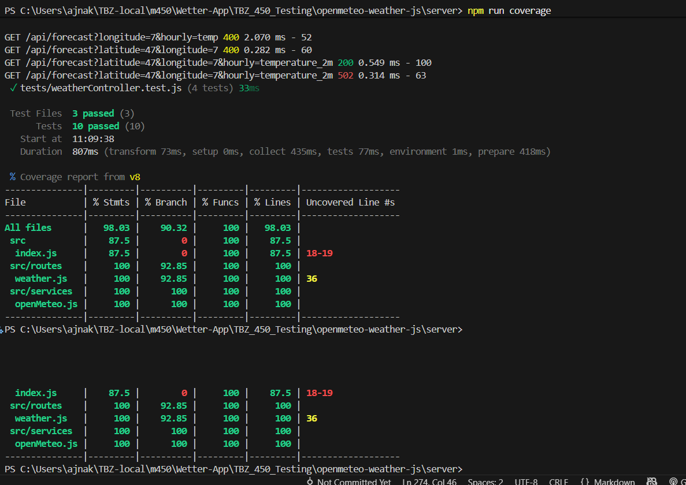

# Open‑Meteo Wetter‑App (JS Backend + HTML/JS Frontend)

## Struktur
```
├── openmeteo-weather-js/
├── Repo_Aufgaben/
├── server/
│ ├── node_modules/
│ ├── src/
│ │ ├── routes/
│ │ │ └── weather.js
│ │ ├── services/
│ │ │ ├── openMeteo.js
│ │ │ └── openMeteo.test.js
│ │ └── index.js
│ ├── .env
│ ├── .env.example
│ ├── package-lock.json
│ └── package.json
├── web/
│ ├── about.html
│ ├── app.js
│ ├── forecast.html
│ ├── index.html
│ ├── settings.html
│ └── styles.css
└── README.md
```

## Start
```bash
# Backend
cd openmethe-wather-js/server
npm install
npm start   # http://localhost:4000

# Frontend
# Öffne web/index.html direkt im Browser

#Test 
cd openmethe-wather-js/server
npm test 
```


## Beispiel-Request
```
GET http://localhost:4000/api/forecast?latitude=47.3769&longitude=8.5417&hourly=temperature_2m,weather_code&timezone=Europe/Zurich
```

## 1. Planung 

### Ziel:
Eine kleine Wetter-App, die Vorhersagedaten von Open-Meteo
 abruft, im Backend cached und im Frontend visualisiert.

### Technologien:

**Backend:** Node.js, Express 
Dieses Backend ruft die Open-Meteo-API ab und cached Antworten kurzzeitig.  
Die Business-Logik wird mit **Vitest** (JavaScript) getestet – nach dem **TDD-Zyklus: Red → Green → Refactor**.

**Frontend:** HTML, CSS, Chart.js (Diagramme)

**Tests:** vitest

### Vorgehen:

1. Backend aufsetzen 

2. Frontend bauen → Form, Tabelle, Chart

3. Tests planen

4. Start lokal sicherstellen


## TAG 07 Übungen     
## Testing Backend 
Die Controller-Tests prüfen den Weather Controller (routes/weather.js), der auf dem Express-Server läuft.
Hierbei wird Supertest verwendet, um echte HTTP-Requests gegen die Express-App (index.js) zu simulieren.

### Controller
**Fehlerfall** 

- Request ohne latitude → Controller gibt 400 Bad Request mit Fehlermeldung zurück.
- Request ohne Vorhersageparameter → Controller gibt 400 Bad Request zurück.
-Wenn getForecast im Service einen Fehler wirft → Controller gibt 502 Bad Gateway zurück.

**gültige Anfrage**

Request mit latitude, longitude und hourly → Service wird aufgerufen, Controller gibt 200 OK + JSON zurück.

### Service-/Mapper-Tests
Die Service-Tests prüfen die Hilfsklasse openMeteo.js.
Dieser Service kümmert sich um Caching und API-Kommunikation mit Open-Meteo.

**Deterministisches Verhalten von `cacheKey`**
- Reihenfolge der Parameter darf keinen Einfluss auf den Key haben.

**Caching-Verhalten von `getForecast`**
- Beim ersten Aufruf wird ein API-Call durchgeführt (hier per `fetch` gemockt).
- Beim zweiten Aufruf mit gleichen Parametern wird das Ergebnis **aus dem Cache** zurückgegeben.
- Mit **Chai SoftAssertions (`chaiExpect`)** wird überprüft, dass mehrere Bedingungen gleichzeitig erfüllt sind:
  - Ergebnis enthält `{ ok: true }`
  - Beide Ergebnisse (`res1` und `res2`) sind inhaltlich korrekt
  - Beide Referenzen zeigen auf dasselbe Objekt (Cache).

**Fehlerfall – API-Error**
- Wenn `fetch` einen Fehlerstatus liefert (`ok: false`) → `getForecast` wirft eine Exception.

#### Relultat 


### Reports 
Für automatisierte Reports wurde Vitest Coverage eingerichtet.
#### package.json
```
"scripts": {
  "test": "vitest --run",
  "coverage": "vitest run --coverage"
}
```

#### vitest.config.js
```
import { defineConfig } from "vitest/config";

export default defineConfig({
  test: {
    coverage: {
      provider: "v8",
      reporter: ["text", "html"],
      reportsDirectory: "./coverage",
    },
  },
});
```



## Pipeline
```
name: Node.js CI – OpenMeteo Weather

on:
  push:
    branches: [ main ]
  pull_request:
    branches: [ main ]

jobs:
  build-test:
    runs-on: ubuntu-latest

    defaults:
      run:
        working-directory: openmeteo-weather-js/server  

    steps:
      - name: Checkout repository
        uses: actions/checkout@v4

      - name: Setup Node.js
        uses: actions/setup-node@v4
        with:
          node-version: 20

      - name: Install dependencies
        run: npm ci

      - name: Build project
        run: echo "Build step – Node/Express benötigt keinen Build-Prozess."

      - name: Run tests
        run: npx vitest --run --reporter=junit --outputFile=vitest-report.xml

      - name: Upload test report
        uses: actions/upload-artifact@v4
        with:
          name: vitest-report
          path: openmeteo-weather-js/server/vitest-report.xml
 
```
### Auslöser
- **Push** auf den Branch `main`
- **Pull Request** auf den Branch `main`

### Ablauf

| Schritt | Beschreibung |
|----------|---------------|
| **Checkout repository** | Klont das Repository in den Runner |
| **Setup Node.js** | Installiert Node.js Version 20 |
| **Install dependencies** | Führt `npm ci` aus, um Abhängigkeiten zu installieren |
| **Build project** | Kein Build-Prozess notwendig (Node/Express) |
| **Run tests** | Führt Tests mit `vitest` aus und erstellt einen JUnit-Testreport |
| **Upload test report** | Lädt den Testreport als Artefakt hoch |


In diesem Bild sieht man, dass die Pipeline funktioniert und die Tests auch erfolgreicht durchgegangen sind. Unter diesen [Link](https://github.com/LeonWWImmo/TBZ_450_Testing/actions/runs/18772781344/job/53560511314) ist die Pipeline.